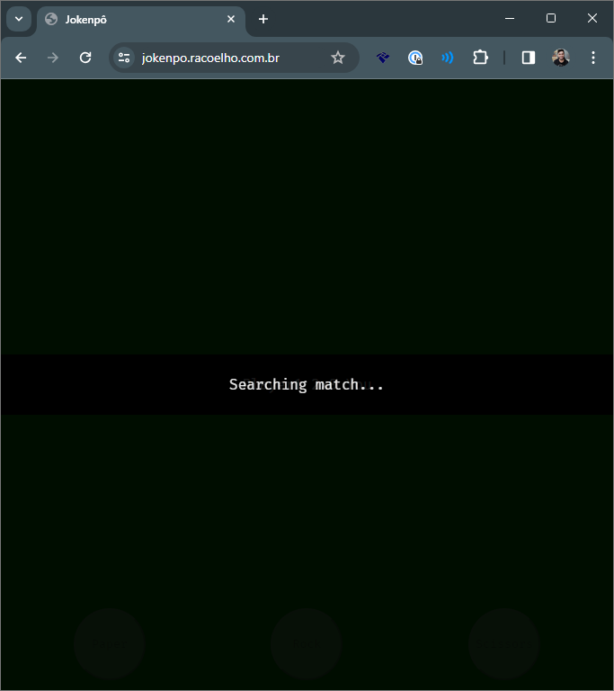
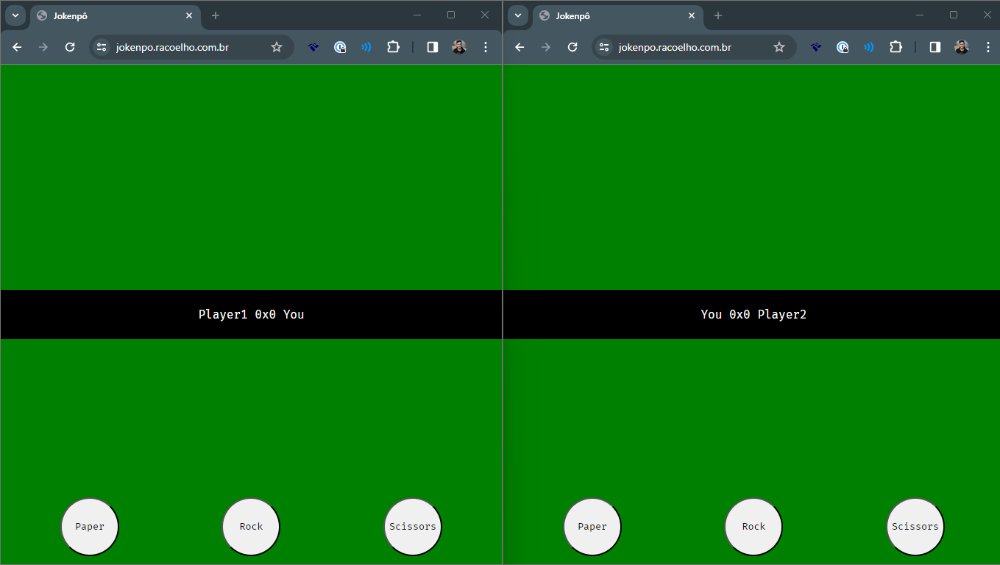
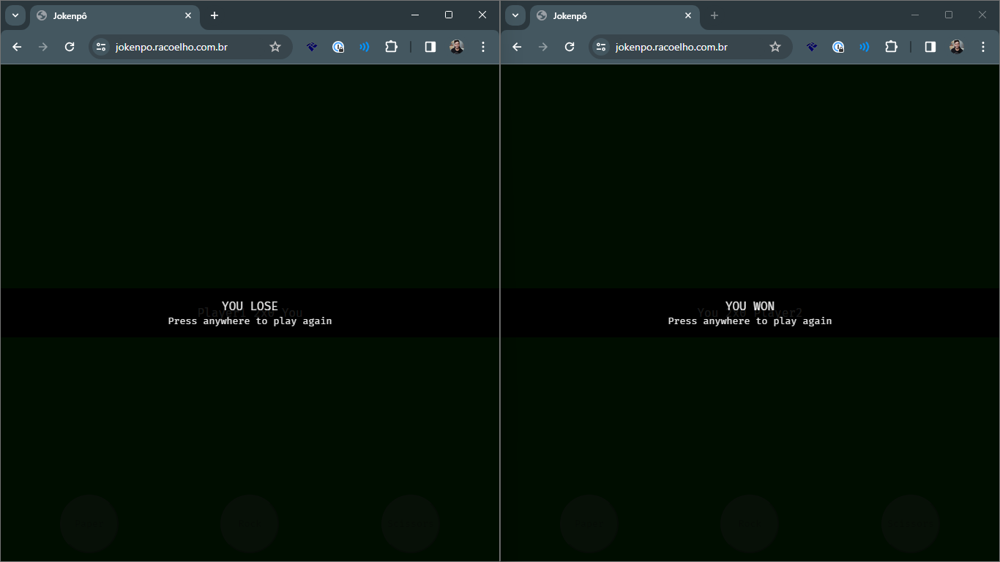

<h1 align="center">Jokenpo</h1>

  

  

  

#### :sparkles: About the project
It's a multiplayer Paper, Rock, and Scissors game.
It manages multiple players and matches simultaneously using WebSockets.

#### :rocket: Used Technologies

- [NodeJS](https://nodejs.org/en)
- [Socket.IO](https://www.npmjs.com/package/socketio)
- [Express](https://www.npmjs.com/package/express)

#### How to run it

You can setup the server port on the environment variable: `NODE_PORT` (if you don't, it will use 3000 as default) and setup the logs on terminal by setting `NODE_ENV=dev`.

With the server running, open your browser on the application url (e.g.: `http:///localhost:3000`).

**Important:**
The game requires two browsers connected to start a match

#### Is there a demo? 
Sure! Here: [Play now](https://jokenpo-eacj.onrender.com/)

#### :tv: Screenshots

##### Searching Room: 

##### Playing: 

##### Match Result:

